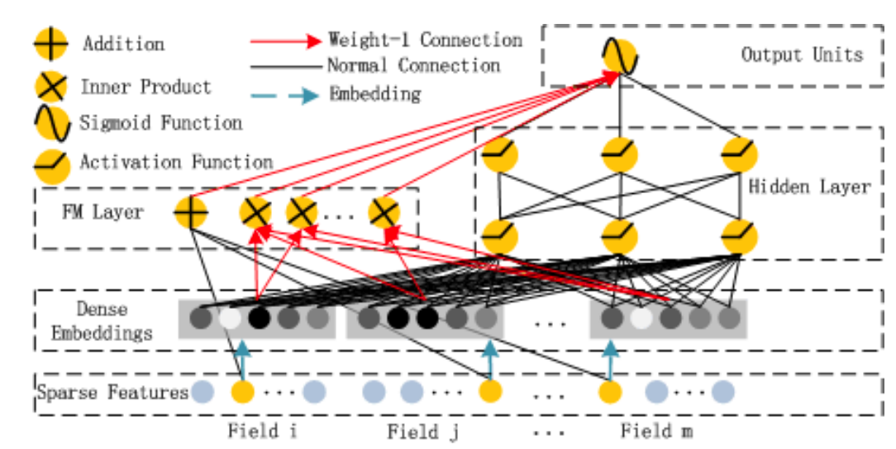
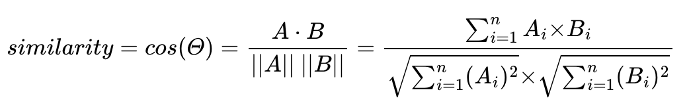

# Urscent
Machine Learning Part

## Summary
- 머신러닝을 적용한 향수 추천 및 검색 웹페이지 서비스 런칭
- 크롤링을 통한 향수 데이터 수집 후 데이터 정제
- 머신러닝, 딥러닝 모델을 활용하여 사용자 취향에 맞는 향수 추천과 유사한 향수 아이템 추천

## Dataset
- 향수 데이터 수집
- Python `beautifulsoup4` 라이브러리 활용하여 크롤링

## Recommend System Modeling
- **User-based recommend system**
    - [DeepFM: A Factorization-Machine based Neural Network for CTR Prediction](https://arxiv.org/pdf/1703.04247.pdf) 모델 활용
    
    - Sparse Features (X)
        - Categorical 변수 (계절, 성별 등) one-hot vector 로 변환
        - Continuous 변수 (rating, 유저 나이 등)
    - Target (Y)
        - 0, 1 binary 데이터 (Not-Click, Click)
        - Rating 이 8 이상이면 1, rating 이 8 미만이면 0
        - 유저 별 추천 향수 리스트
    - Loss
        - Cross Entropy
    - Evaluation Metrics
        - Accuracy 기준 0.8235 달성 (진행 중)

- **Item-based recommend system**
    - 향수 별 속성 값을 활용해 feature embedding
        - 활용 속성 종류 (예시 [link](https://docs.google.com/spreadsheets/d/1eQTbjcvhcbyXSpYoAV91XCwo3wD3o_3LoQN2e_xtH68/edit#gid=0))
            - 향수 3가지 note (Top, heart, base)
                - 향수 당 포함하고 있는 note 를 one-hot vector 로 표현 (24*3 = 72-d vector)
                - 모든 향수 pair 에 대한 cosine similarity 계산
                - Note 리스트 (24개)
                ```
                'Aldehydes', 'Amber', 'Animalicnotes', 'Aquaticnotes', 'Balsamicnotes', 'Citricnotes', 'Earthynotes', 'Floralnotes', 'Fragranceingredients', 'Fruitynotes', 'Gourmandynotes', 'Grain', 'Greennotes', 'Herbaceousnotes', 'Mineralnotes', 'Mossynotes', 'Musk', 'Notclassified', 'Orientalnotes', 'Powderynotes', 'Resinousnotes', 'Smokynotes', 'Spicynotes', 'Textilenotes', 'Tobacco', 'Woodynotes'
                ```
            - 향수 text
                - Pre-trained BERT 로 text embedding
                - 모든 향수 pair 에 대한 cosine similiarty 계산
                - Gentleman Givenchy Réserve Privée 향수 설명 (text) 예시
                ```
                Gentleman Givenchy Réserve Privée is a new perfume by Givenchy for men and was released in 2022. The scent is sweet-spicy. The longevity is above-average. It is being marketed by LVMH. PRONUNCIATION
                ```
            - 계절감
                - 향수 별 계절감 속성을 비율에 따라 4-d vector 로 표현
                - 4-d vector 를 향수 note 또는 향수 text 에 concatenate 한 후, 모든 향수 pair 에 대한 cosine similarity 계산 (계절감 만으로는 향수 속성을 embedding 하기에 불충분하다고 판단)
                - 계절감 예시
                ```
                Spring 20%, Summer 0%, Fall 40%, Winter 40%
                ```
    - 최종적으로 target 향수와 가장 유사한 cosine similarity 를 가진 top K 향수 추천
        - 코사인 유사도
        

- Machine Learning 파이프라인 (TODO)
    - 서비스 런칭에 따른 사용자 및 향수 데이터 업데이트
    - 사용자 데이터, 아이템 데이터를 고려한 모델 업데이트
    - Backend 연동 API 개발
    